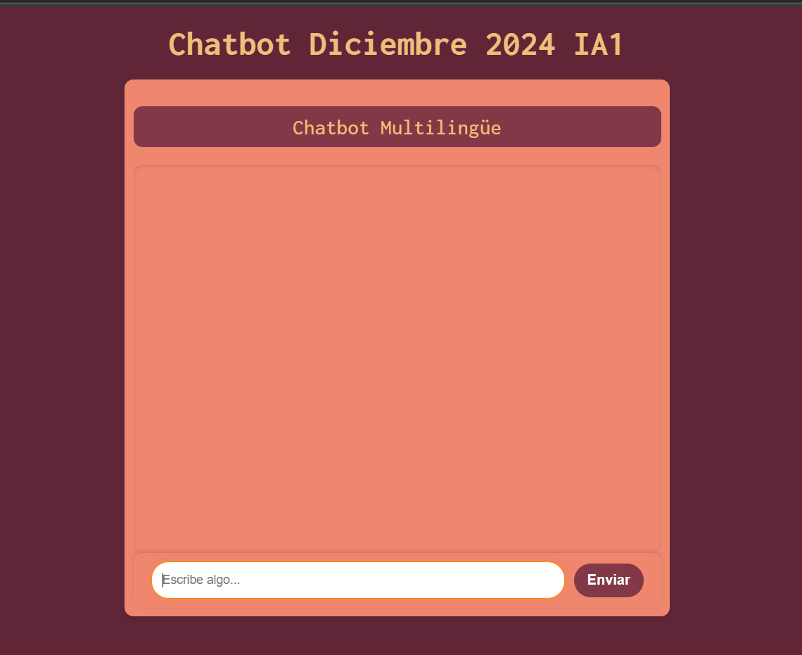

# Manual de Usuario

1. [Requisitos del Sistema](#sistema)
2. [Despliegue](#despliegue)
3. [Descripción de la Interfaz de Usuario](#interfaz)

### Requisitos minimos del entorno o servidor de aplicacion 
#### 1. Hardware

- Procesador de doble núcleo (dual-core) a 1.8 GHz o superior.
- 4 GB de RAM como mínimo.
- Espacio de almacenamiento mínimo, suficiente para un navegador web moderno (aproximadamente 100 MB).
- Conexión a Internet estable de al menos 10 Mbps para garantizar tiempos de carga rápidos en GitHub Pages.

#### 2. Software

- Navegador web moderno compatible con HTML5 y JavaScript (por ejemplo, Google Chrome, Mozilla Firefox, Microsoft Edge).
- No se requiere base de datos local ni backend, ya que la funcionalidad está alojada en GitHub Pages.
- El frontend está desarrollado en React y está completamente alojado en GitHub Pages.

### Despligue del software 

El chatbot básico está implementado en GitHub Pages, lo que permite un acceso fácil y sin complicaciones desde cualquier navegador web moderno.

El despliegue del proyecto se realiza siguiendo estos pasos:

- Preparación del código: El código fuente del chatbot, desarrollado en JavaScript/HTML, se aloja en un repositorio de GitHub.
- Configuración de GitHub Pages:
    * Accede a la configuración del repositorio en GitHub.
    * Habilita GitHub Pages desde la pestaña Pages, seleccionando la rama principal o una carpeta específica como fuente de publicación.
- Publicación automática: Los cambios realizados en el repositorio se reflejan automáticamente en el chatbot desplegado.
El despliegue en GitHub Pages elimina la necesidad de infraestructura adicional, garantizando accesibilidad y simplicidad.

Para ingresar a la plataforma se tiene que seguir el siguiente enlace:[Visita GitHub](https://github.com)

### Descripción de la Interfaz de Usuario 

La plataforma tiene como objetivo proporcionar un chatbot básico que permite a los usuarios entablar una conversación sencilla y obtener soporte básico. Este chatbot responde a preguntas frecuentes y guía a los usuarios en operaciones simples, ofreciendo una experiencia accesible desde cualquier navegador web compatible.

El chatbot está diseñado para cubrir necesidades fundamentales de soporte, sin funcionalidades avanzadas, pero suficiente para asistir en tareas y consultas comunes. Está disponible a través de GitHub Pages, sin necesidad de instalaciones adicionales.

