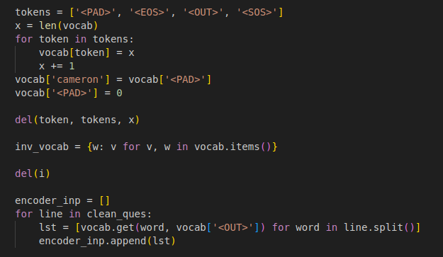
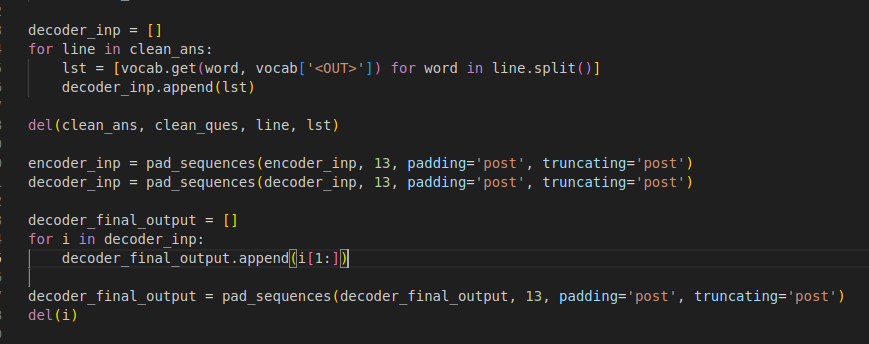
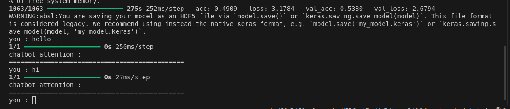

# Manual Tecnico Seq2Seq

Para este modelo utilizaremos una arquitectura de aprendizaje profundo diseñada para transformar una secuencia de datos de entrada en otra secuencia de datos de salida, con longitudes diferentes. Es ampliamente utilizado en tareas como traducción automática.

## Componentes Principales

1. **Encoder**:
   - Es el encargado de recibir la secuencia de entrada y la convierte en un vector de contexto.

2. **Decoder**:
   - Toma el vector de contexto generado por el codificador y produce la secuencia de salida.

3. **Mecanismo de Atención (opcional)**:
   - Permite al decodificador enfocarse en partes específicas de la secuencia de entrada en cada paso de generación.
   - Mejora la calidad en tareas donde las relaciones locales son importantes, como traducción y procesamiento del lenguaje natural.

## Funcionamiento

1. **Codificación**:
   - La secuencia de entrada se procesa token por token.
   - El codificador produce un estado oculto que resume la información de toda la secuencia de entrada.



2. **Decodificación**:
   - Utiliza el estado oculto del codificador como entrada inicial.
   - Genera los tokens de la secuencia de salida uno por uno, utilizando los estados ocultos previos y los tokens generados anteriormente.



3. **Pérdida**:
   - La salida generada se compara con la secuencia de salida esperada utilizando funciones de pérdida como "cross-entropy".

## Arquitecturas Comunes

1. **Seq2Seq Simple**:
   - Codificador y decodificador con RNN, LSTM o GRU.
   - Limitado por la capacidad del vector de contexto.

2. **Seq2Seq con Atención**:
   - Introduce un mecanismo de atención para superar las limitaciones del vector de contexto.
   - Ejemplo: Modelo de Bahdanau o Luong Attention.

3. **Transformers**:
   - Sustituyen las RNNs con mecanismos de auto-atención.
   - Ejemplo: El modelo de traducción Transformer de Vaswani et al. y su variante BERT o GPT.

## Ventajas

- Capaz de manejar secuencias de longitud variable.
- Flexibilidad para adaptarse a diversos tipos de datos secuenciales.
- Mejora en la traducción automática y otras tareas lingüísticas.

## Desventajas

- Sensible a problemas de gradiente en RNNs tradicionales.
- Requiere mucha capacidad computacional en versiones avanzadas como Transformers.
- Puede generar salidas incoherentes si no está bien entrenado.

## Ejemplo de Aplicación



# Comandos

## Librerias
```
sudo apt install python3-venv
python3 -m venv .venv
source .venv/bin/activate

pip3 install tensorflow
pip install tensorflow-addons==0.11.2


deactivate

```

